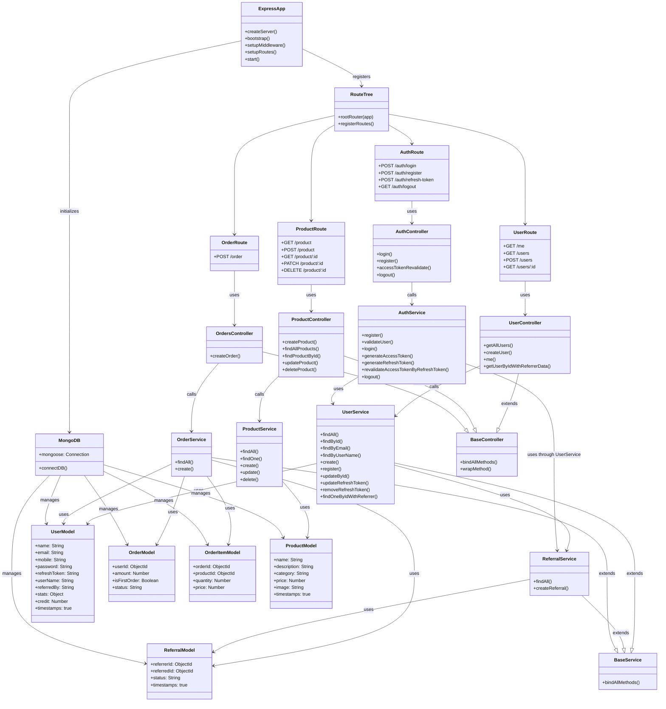

# 🚀 Referral and Credit System

A full-stack web application where users can register, share referral links, and earn credits when their referred users sign up and make purchases. Both the referrer and the referred user receive **2 credits** on the first purchase.

🔗 **Live Demo:** [Frontend](https://referral-and-credit-system-web.onrender.com/) | [Backend](https://referral-and-credit-system.onrender.com/)
📘 **API Docs:** [Swagger Documentation](https://referral-and-credit-system.onrender.com/api-docs)

---

## 🧠 Overview

This project implements a **referral-based credit reward system** using a modern full-stack setup.
Built with **TurboRepo**, the monorepo structure contains both the frontend and backend apps, as well as a shared validation package using **Zod**.

---

## 🏗️ Tech Stack

**Frontend:** [Next.js](https://nextjs.org/)
**Backend:** [Express.js](https://expressjs.com/) + [MongoDB](https://www.mongodb.com/)
**Validation:** [Zod](https://zod.dev/) (in a shared package)
**Monorepo Management:** [Turborepo](https://turbo.build/repo)
**Package Manager:** [pnpm](https://pnpm.io/)

---

## 🧩 Project Structure

```
Referral-and-credit-system/
├── apps/
│   ├── api/     # Express.js backend
│   └── web/     # Next.js frontend
└── packages/
    └── validations/  # Shared Zod validation schemas
```

---

## ⚙️ Environment Variables

### Backend (`apps/api/.env`)
```env
NODE_ENV=development
PORT=8080
LOG_LEVEL=
MONGO_URI=
JWT_SECRET=
API_URL=https://referral-and-credit-system.onrender.com
```

### Frontend (`apps/web/.env`)
```env
NEXT_PUBLIC_API_URL=http://localhost:8080/api
```

> ⚠️ **Note:** Replace sensitive credentials (like `MONGO_URI` and `JWT_SECRET`) with your own secure values before deployment.

---

## 🧑‍💻 Development

### Install dependencies
```bash
pnpm install
```

### Run all apps in development mode
```bash
pnpm dev
```

### Run a single app
```bash
pnpm dev --filter=web      # Run only frontend
pnpm dev --filter=api      # Run only backend
```

### Build and start
```bash
pnpm build
pnpm start
```

---

## 📜 API Documentation

The backend exposes a detailed Swagger UI for testing and exploring API endpoints.

**📍 URL:** [https://referral-and-credit-system.onrender.com/api-docs](https://referral-and-credit-system.onrender.com/api-docs)

---

## 📜 Backend Diagram



## 🧭 Roadmap

- [ ] Fully mobile-responsive frontend
- [ ] Admin panel for product management
- [ ] Admin panel for order management
- [ ] Credit history and transaction logs
- [ ] Enhanced referral analytics

---


## 🌟 Acknowledgements

- [Turborepo](https://turbo.build/repo) for monorepo management
- [Render](https://render.com/) for deployment
- [Zod](https://zod.dev/) for data validation
